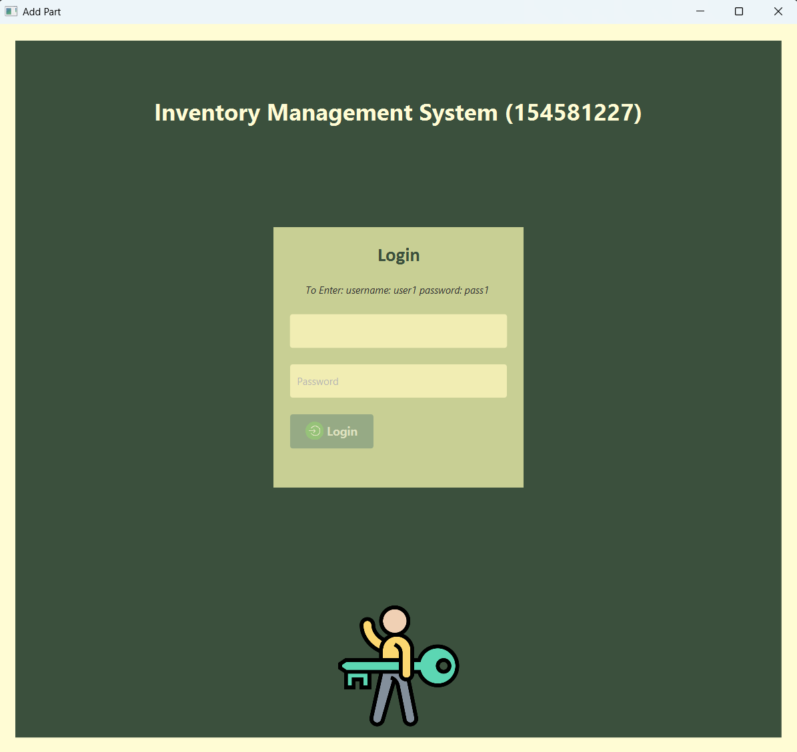
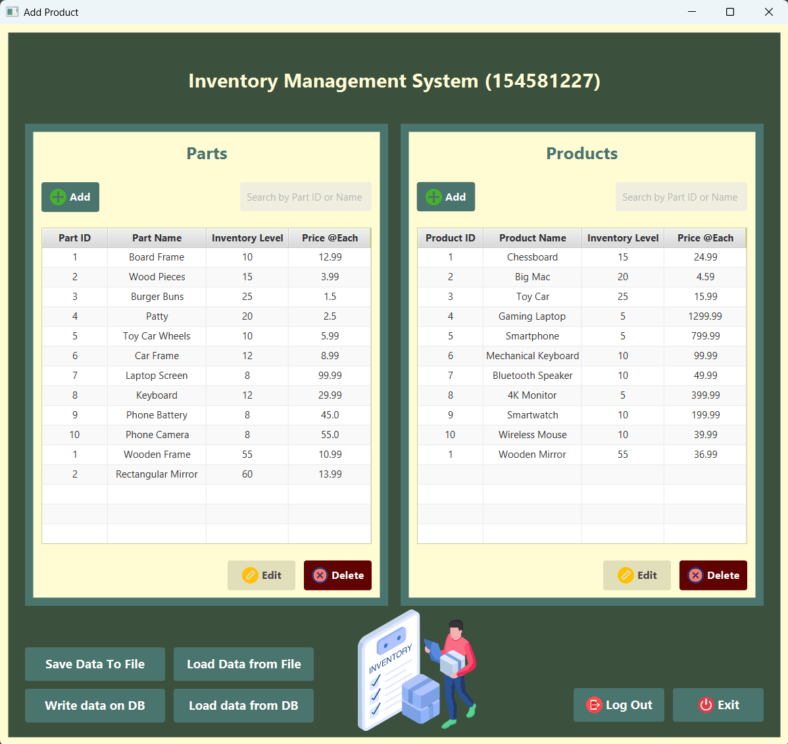
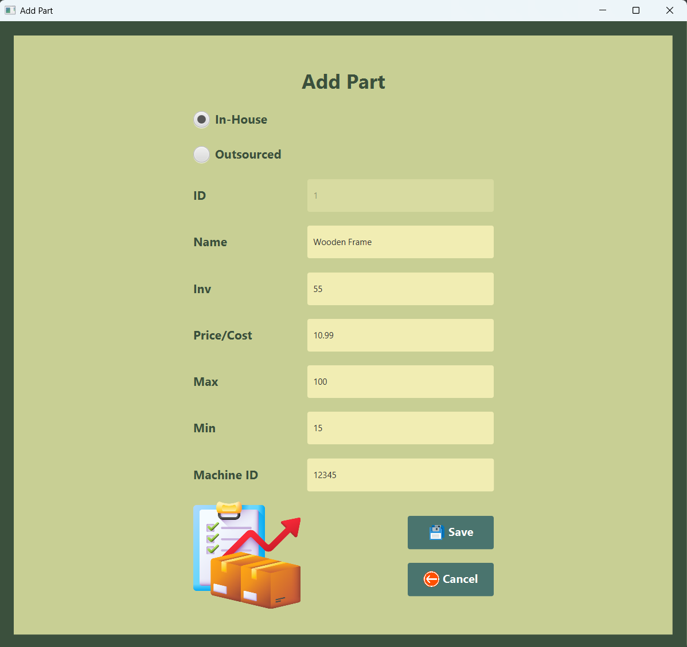
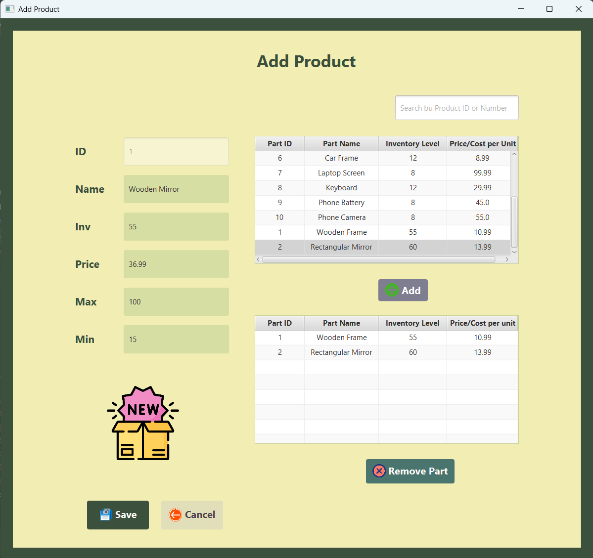

# Inventory Management System

A comprehensive JavaFX-based desktop application for managing inventory parts and products with persistent data storage capabilities.

## 📋 Overview

This Inventory Management System provides a complete solution for tracking parts and products in an inventory. Built with JavaFX and featuring an intuitive user interface, it supports both file-based and database storage options.

## ✨ Features

### 🔐 User Authentication

- Secure login system with predefined credentials
- Session management with logout functionality

### 📦 Parts Management

- **Add Parts**: Create new inventory parts (In-House or Outsourced)
- **Modify Parts**: Edit existing part details
- **Delete Parts**: Remove parts with confirmation dialogs
- **Search Parts**: Find parts by ID or name
- **Part Types**:
  - **In-House**: Parts manufactured internally with machine ID tracking
  - **Outsourced**: Parts from external suppliers with company name tracking

### 🏭 Products Management

- **Add Products**: Create products with associated parts
- **Modify Products**: Update product information and part associations
- **Delete Products**: Remove products (only if no associated parts)
- **Search Products**: Find products by ID or name
- **Associated Parts**: Link multiple parts to products

### 💾 Data Persistence

- **File Storage**: Save/load inventory data to/from `.dat` files
- **Database Storage**: SQLite database integration for robust data management
- **Serialization**: Custom serialization for complex object relationships

### 🎨 User Interface

- Modern JavaFX interface with custom styling
- Responsive design with intuitive navigation
- Visual feedback with icons and color-coded elements
- Form validation with comprehensive error handling

## 🛠️ Technical Stack

- **Language**: Java
- **UI Framework**: JavaFX with FXML
- **Database**: SQLite
- **Architecture**: MVC (Model-View-Controller)
- **Build Tool**: Maven
- **Data Storage**: File serialization & SQLite database

## 📁 Project Structure

```
src/main/java/ca/demo/
├── Controllers/          # JavaFX Controllers
│   ├── AddPartController.java
│   ├── AddProductController.java
│   ├── LoginController.java
│   ├── MainViewController.java
│   ├── ModifyPartController.java
│   └── ModifyProductController.java
├── Models/              # Data Models
│   ├── InHouse.java
│   ├── Inventory.java
│   ├── Login.java
│   ├── OutSourced.java
│   ├── Part.java
│   └── Product.java
├── Utility/             # Helper Classes
│   ├── AlertHelper.java
│   ├── FieldValidator.java
│   ├── SceneName.java
│   └── TableColumnModifier.java
├── database/            # Database Access
│   └── DatabaseAccess.java
└── InventoryApplication.java  # Main Application Class

src/main/resources/ca/demo/
├── *.fxml              # JavaFX Scene Files
└── assets/             # Images and Icons
```

## 📸 Screenshots

**Login interface**  


**Main dashboard**  


**Part management**  


**Part management**  


## 🚀 Getting Started

### Prerequisites

- Java 11 or higher
- JavaFX runtime
- Maven (for dependency management)

### Installation

1. Clone the repository
2. Navigate to the project directory
3. Build the project using Maven:
   ```bash
   mvn clean compile
   ```
4. Run the application:
   ```bash
   mvn javafx:run
   ```

### Login Credentials

- **Username**: `user1`
- **Password**: `pass1`

Alternative:

- **Username**: `user2`
- **Password**: `pass2`

## 💡 Usage

### Adding Parts

1. Click "Add" in the Parts section
2. Select part type (In-House or Outsourced)
3. Fill in required fields:
   - Name, Price, Inventory Level, Min/Max values
   - Machine ID (In-House) or Company Name (Outsourced)
4. Click "Save" to confirm

### Creating Products

1. Click "Add" in the Products section
2. Enter product details
3. Search and add associated parts from the available parts list
4. Ensure product price meets validation requirements
5. Save the product

### Data Management

- **Save to File**: Export inventory data to `.dat` files
- **Load from File**: Import previously saved inventory data
- **Database Operations**: Write to or load from SQLite database

## 🔧 Key Components

### Models

- **Part**: Abstract base class for inventory parts
- **InHouse**: Parts manufactured internally
- **OutSourced**: Parts from external suppliers
- **Product**: Products composed of multiple parts
- **Inventory**: Central inventory management system

### Controllers

- **LoginController**: Handles user authentication
- **MainViewController**: Main dashboard and navigation
- **AddPartController**: Part creation functionality
- **ModifyPartController**: Part editing functionality
- **AddProductController**: Product creation functionality
- **ModifyProductController**: Product editing functionality

### Utilities

- **AlertHelper**: Standardized dialog management
- **FieldValidator**: Input validation utilities
- **TableColumnModifier**: UI table customization
- **DatabaseAccess**: SQLite database operations

## 🎯 Validation Rules

### Parts

- All numeric fields must be positive values
- Stock level must be between min and max values
- Max value must be greater than min value
- Machine ID must be numeric (In-House parts only)

### Products

- Must have at least one associated part
- Product price cannot be less than the cost of any associated part
- Standard min/max/stock validation applies

## 🔄 Future Enhancements

- Advanced reporting capabilities
- Inventory alerts for low stock
- Barcode scanning integration
- Multi-user support with role-based access
- Enhanced search and filtering options

## 📄 License

This project is developed as part of academic coursework and is for educational purposes.

---

**Note**: This application demonstrates comprehensive Java programming concepts including object-oriented design, JavaFX UI development, file I/O operations, database integration, and MVC architecture patterns.
